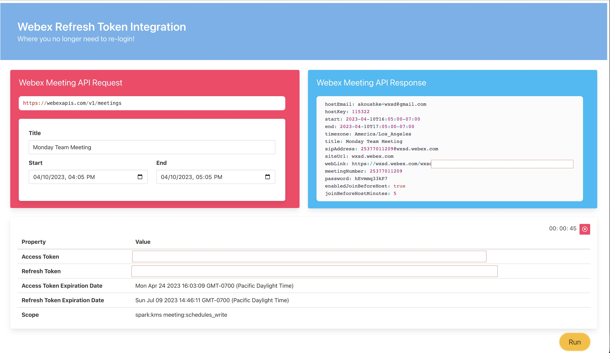
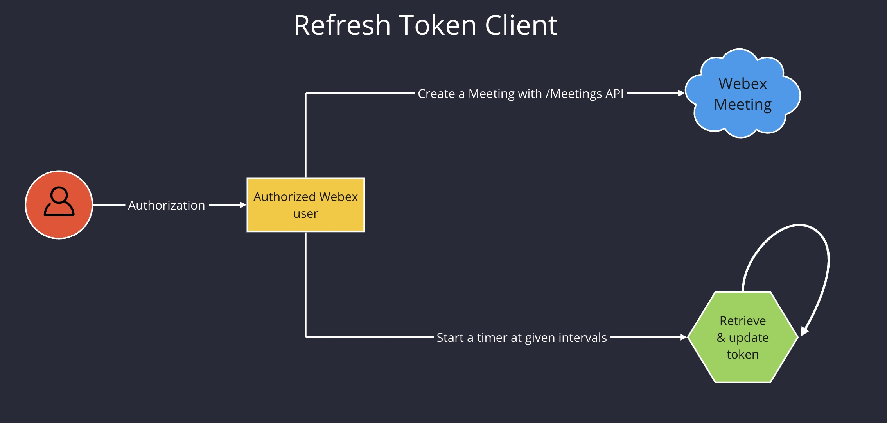
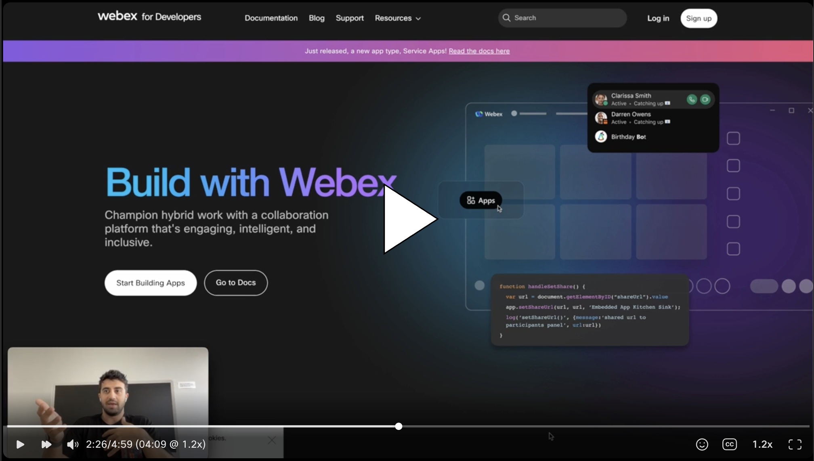

<!-- _____________________________________________________________________________________________________________________________________ -->
<!--                                              Basic Repo Steps                                                            -->

<!-- # Repo-Template
This is an Internal WXSD Template to be used for GitHub Repos moving forward. Follow the following steps: Visit https://github.com/wxsd-sales/readme-template/blob/master/README.md for extended details.
-->


<!--   Step 1) Name your repository: Names will ALWAYS start with "bot - ", "integration -", "macro -", or "supportapp -" 
Examples:"bot- <insert repo name>" 
       "integration - <insert repo name>"
       "macro - <insert repo name>"
       "supportapp - <insert repo name>" 

~3 words, kebab case, use words to indicate what it does. Visit https://github.com/wxsd-sales/readme-template/blob/master/README.md for more details  
-->

<!--  Step 2) Add One sentence description to your repository: Copy/Paste from Webex Labs Card sentence.
       Example: "Redirect an Auto Attendant caller to an SMS conversation to alleviate Call Queue Agent responsibilities."
-->

<!--  Step 3) Add at least 1 tag to the repo: Indicating if it’s a “bot”, “macro” or “embeddedapp”.       
                 *Additional tags are allowed: should be lowercase and hyphenated for spaces.
                Repo does not use “macros” as a tag (use “macro” instead)
-->

<!--  Step 4) MAKE SURE an MIT license is included in your Repository, unless management has communicated otherwise. If another license is needed, please verify with management. This is for legal reasons.
-->

<!--  Step 4) Use following Template to copy/paste your details below in place of the directions 
Make sure you include the "Keep this here" portions (it is for legal, and security infosec reasons).
-->

<!-- _____________________________________________________________________________________________________________________________________ -->

<!--                                                Actual Template Starts Below                                                           -->


# Refresh Token Client
Welcome to our WXSD DEMO Repo! <!-- Keep this here --> 
In here you will find the source code to PoC which displays the process of generating an integrations access token for Cisco Webex and having it continually refreshed for a given interval.
In this PoC we demonstrate an easy way to request for a fresh access_token from the current token object. This PoC is just a tool for developers to understand our Oauth 2.0 flow easier.

 <!--- Insert a screenshot, gif or image below that shows a little about your Demo/PoC -->
 


<!-- Keep the following here -->  
 *_Everything included is for demo and Proof of Concept purposes only. Your use of the site is solely at your own risk. This site may contain links to third party content, which we do not warrant, endorse, or assume liability for. These demos are for Cisco Webex usecases, but are not Official Cisco Webex Branded demos._

## Table of Contents <!-- Keep the following here -->  
<!-- ⛔️ MD-MAGIC-EXAMPLE:START (TOC:collapse=true&collapseText=Click to expand) -->
<details>
<summary>(click to expand)</summary>
    
  * [Overview](#overview)
  * [Setup](#setup)
  * [Demos](#demos)
  * [License](#license)  
  * [Questions](#questions)

</details>
<!-- ⛔️ MD-MAGIC-EXAMPLE:END -->


## Overview
This PoC follows a simple Webex Oauth2.0 flow for authenticating the user initially. it then stores the token data inside browser local storage and displays the details in a table formatted UI. It then leaves the user with two options to either request for a fresh token object at a given interval or/and request to create a meeting 


### Flow Diagram
<!-- *MANDATORY* Insert Your Flow Diagram Here -->



## Setup

### Prerequisites & Dependencies: The following instructions assume that you have:

- [Node v18.0.0](https://nodejs.org/en/blog/announcements/v18-release-announce)
- [Node Version Manager](https://www.freecodecamp.org/news/node-version-manager-nvm-install-guide/)
- [Svelte Basic Understandings](https://svelte.dev/)


<!-- GETTING STARTED -->

### Installation Steps:
1. Create an `.env` file at the root level
2. Copy all variables declared inside `.env.example` file into `.env` file
3. Select the proper node version
    ```sh
    nvm use
    ```
4.  Install node modules
    ```sh
     npm i
     ```
5.  Start the server
    ```sh
    npm run dev
    ```
    
## Demo

<!-- Insert link to the website below (if deployed). -->
Check out our live demo, available [here](https://refresh-token.wbx.ninja)!

<!-- Keep the following statement -->
*For more demos & PoCs like this, check out our [Webex Labs site](https://collabtoolbox.cisco.com/webex-labs).


<!-- Update your vidcast title, video screenshot, vidcast/youtube link & name -->
[](https://app.vidcast.io/share/0aaf125f-b02d-4ad3-9a41-6e636d4d7323 "refresh token demo")


## License
<!-- An MIT license should be included in your Repository, unless management has communicated otherwise. If another license is needed, please verify with management. This is for legal reasons.
--> 

<!-- Keep the following statement -->
All contents are licensed under the MIT license. Please see [license](LICENSE) for details.


## Questions

Please contact the WXSD team at [wxsd@external.cisco.com](mailto:wxsd@external.cisco.com?subject=RepoName) for questions. Or, if you're a Cisco internal employee, reach out to us on the Webex App via our bot (globalexpert@webex.bot). In the "Engagement Type" field, choose the "API/SDK Proof of Concept Integration Development" option to make sure you reach our team. 